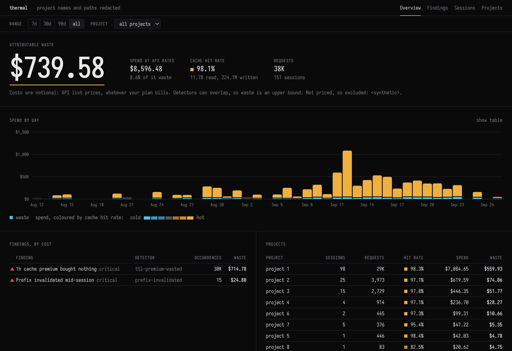
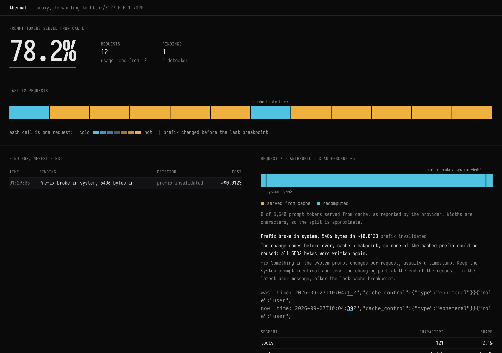
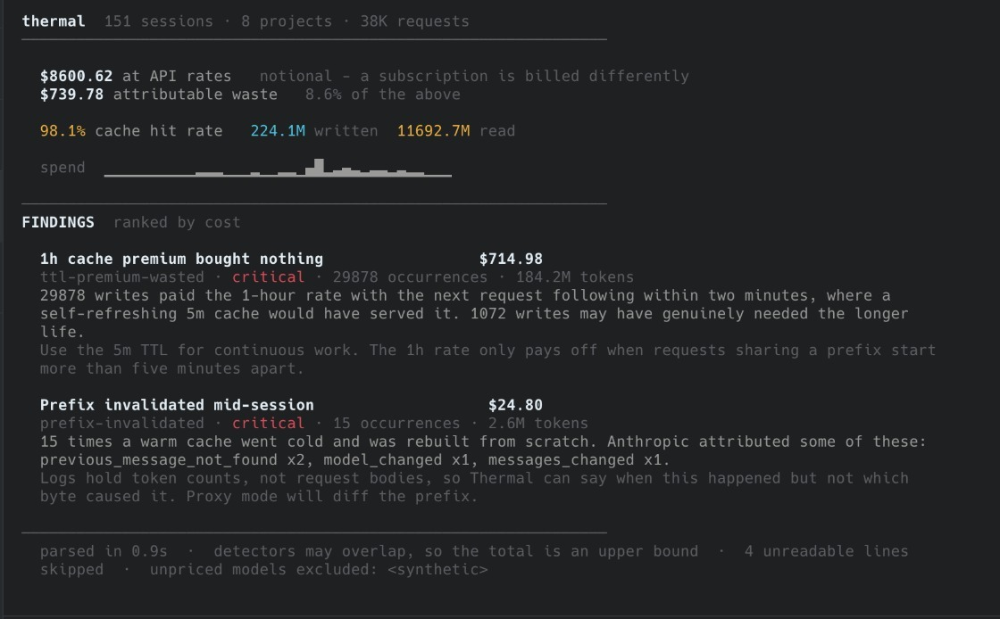
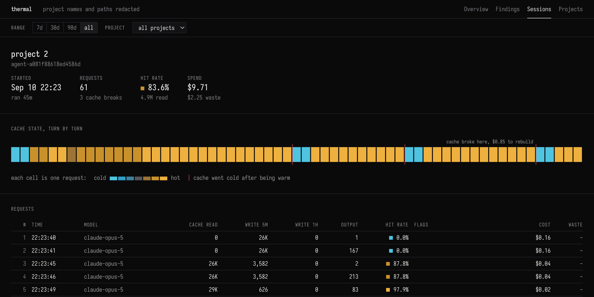

# Thermal

Thermal finds where LLM prompt caching broke and what it cost.

A provider caches the stable front of a request - tools, system prompt, earlier
turns - and bills repeats of it at a fraction of the input price. The cache only
holds while those bytes stay identical. A timestamp in the system prompt, a tool
list that reorders its keys, or a breakpoint in the wrong place makes every call
pay full price again. Nothing errors. The bill goes up.

Thermal runs locally. It sends nothing anywhere: no telemetry, no account, no
upload.

```
npx thermal-cache            # analyse Claude Code logs, then open the dashboard
npx thermal-cache proxy      # watch live API traffic from your own agent
```

Requires Node 20 or later.



The dashboard on 151 real Claude Code sessions, run with `--redact` so project
names do not appear.

## Proxy mode: for agents you build

If you control how prompts are constructed, proxy mode is the useful one. It is
a forwarding proxy on `127.0.0.1:7878`. Requests pass through unchanged; after
each response has been delivered, Thermal compares the request with the previous
one in the same conversation and reports the first byte that changed inside the
cached prefix.

Anthropic:

```
npx thermal-cache proxy
export ANTHROPIC_BASE_URL=http://127.0.0.1:7878
```

OpenAI (Chat Completions and Responses API):

```
npx thermal-cache proxy --upstream https://api.openai.com
export OPENAI_BASE_URL=http://127.0.0.1:7878/v1
```

The official SDKs for both providers read these variables, so most agents need
no code change. Run the agent as usual; findings print as they happen, and
Ctrl-C prints a summary.

The live view at `http://127.0.0.1:7878/_thermal/` shows the same traffic in a
browser: each request as a cell coloured by how much of its prompt was served
from cache, and, for any request you select, the prompt drawn as one bar in
render order (tools, system, messages) split into cached and recomputed bytes,
with the diff at the point it broke. Requests under `/_thermal` are answered by
the proxy and never forwarded.



A demo against a local stand-in server: twelve requests whose system prompt ends
in a timestamp, which changes on request 7. The finding names the segment and
offset where the prefix diverged, and the diff underlines the bytes that changed.

The summary always states whether usage was read from the responses. If it was
not, it says so: a clean result from a proxy that measured nothing is unknown,
not healthy.

## Read mode: Claude Code history

With no arguments, Thermal reads Claude Code's session logs from
`~/.claude/projects` and reports cache hit rate, notional spend, and attributable
waste. 151 sessions (38K requests) parse in 0.9s.



After the terminal report, Thermal serves a dashboard on `127.0.0.1:7870` and
opens it: waste and spend by day, findings with their fixes, projects, and every
session as a turn-by-turn ribbon that marks where the cache went cold. Filters
for time range and project scope every view, and every view has a URL. Pass
`--report`, or pipe the output, for the terminal report alone.



One session of 61 requests. Each red line marks a request that found a warm
cache gone cold and paid to rebuild it.

Logs record token counts, not request bodies, so read mode can say when a cache
went cold but not which byte caused it. That needs proxy mode.

Claude Code's own caching works well - the hit rate above is typical. The
largest finding, the 1-hour TTL premium, is a choice Claude Code makes rather
than one its user can change. Read mode is most useful as a quick look at real
numbers before pointing the proxy at your own agent.

Options:

```
--report           terminal report only, no dashboard
--redact           replace project names and paths, for screenshots you can share
--root <path>      session directory (default: ~/.claude/projects)
--since <days>     only requests from the last N days
--project <name>   only projects whose name contains this
--port <n>         dashboard port (default: 7870) or proxy port (default: 7878)
--upstream <url>   proxy target (default: https://api.anthropic.com)
```

## Detectors

Each finding states what happened, what it cost, and the fix.

| Detector | Mode | Detects |
|---|---|---|
| `prefix-invalidated` | both | A warm cache went cold. In proxy mode, with the diverging bytes. |
| `ttl-premium-wasted` | read | 1-hour cache writes where a 5-minute cache would have stayed warm |
| `cache-never-read` | read | Sessions that wrote a cache and never read it |
| `caching-net-negative` | read | Sessions whose cache reads saved less than the writes cost |
| `tool-set-changed` | proxy | The tool list changed mid-conversation |
| `nondeterministic-tool-json` | proxy | The same tools serialised with a different key order |
| `too-many-breakpoints` | proxy | More than four `cache_control` breakpoints (Anthropic) |
| `prefix-below-minimum` | proxy | Caching requested on a prefix too short to be cached (Anthropic) |
| `cacheable-prefix-uncached` | proxy | A large prompt resent repeatedly with no breakpoint (Anthropic) |
| `automatic-cache-not-landing` | proxy | Large prompts reporting `cached_tokens: 0` (OpenAI) |

Anthropic and OpenAI are handled differently. Anthropic caches up to explicit
`cache_control` breakpoints, so Thermal diffs the bytes before the last one; a
change after it costs nothing and is not reported. OpenAI caches automatically
and reports `cached_tokens` on every response, which Thermal treats as ground
truth instead of diffing.

## Accuracy

- Dollar figures use list prices from `src/pricing.ts`. Models missing from the
  table are excluded from totals and named at the bottom of the report.
- Cache write prices use Anthropic's published multipliers (1.25x input for the
  5-minute TTL, 2x for 1-hour). They have not been checked against an invoice.
- For Claude Code on a subscription, costs are notional: what the same traffic
  would cost at API rates.
- In proxy mode, an Anthropic prefix break is priced from the response's
  `cache_creation_input_tokens`, which includes the turn appended since the
  previous request. OpenAI misses are priced from the tokens the last cache hit
  read. `too-many-breakpoints` and `prefix-below-minimum` carry no dollar
  figure: neither loses tokens that were cached.
- The OpenAI proxy path has been validated against live traffic. The Anthropic
  proxy path has been tested against fixtures and a stub server, not yet against
  the live API.

## Development

```
npm install
npm run build          # typecheck, then compile the CLI and the browser code to dist/
npm test
scripts/slop-check.sh
node src/cli.ts        # run from source (Node 22.6+ strips types natively)
```

The dashboard has no framework and no runtime dependencies: hand-written DOM
and SVG in `src/web/`, compiled by the same TypeScript, with markup, styles and
the font in `web/`. The font is Iosevka (SIL OFL 1.1, `web/fonts/OFL.txt`),
subset to the glyphs the UI uses, 15 kB per weight. Build before running from
source, because the browser code is served from `dist/web/`.

`CLAUDE.md` holds the engineering standards and `SPEC.md` the design and roadmap.

## License

MIT
